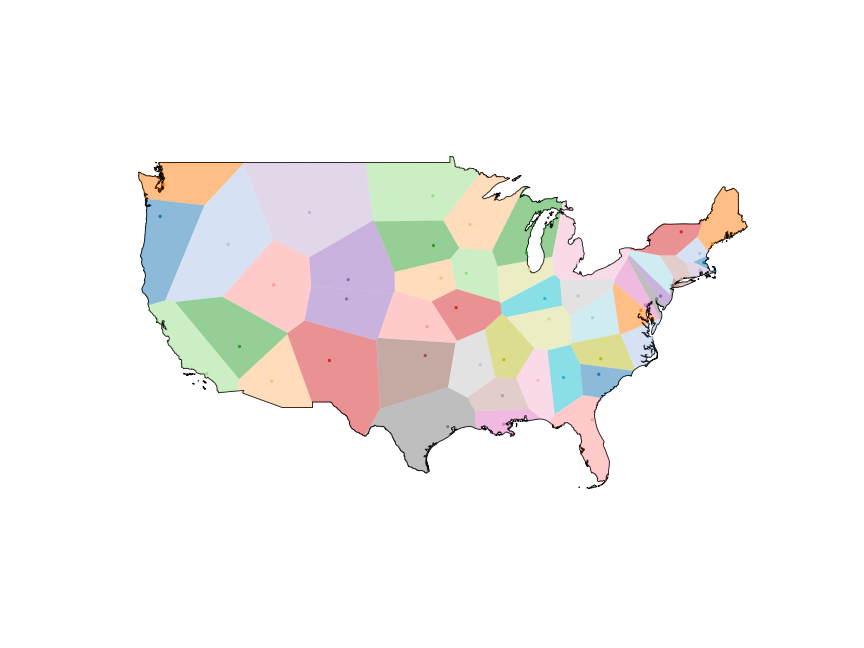

P03 - Voronoi - Real World Use Case
### Sharome Burton
### Description:
This program creates a voronoi diagram over the US creating, polygons around each state. The geospatial rtree is queried to get UFO sighting points that are within each polygon. Results are saved to a json file for future use.

### Instructions:

* Go to https://colab.research.google.com/drive/1wHvlnQ0QeGIcxRc8MeMJg_-fsAdNpQtZ?usp=sharing to view output of program

